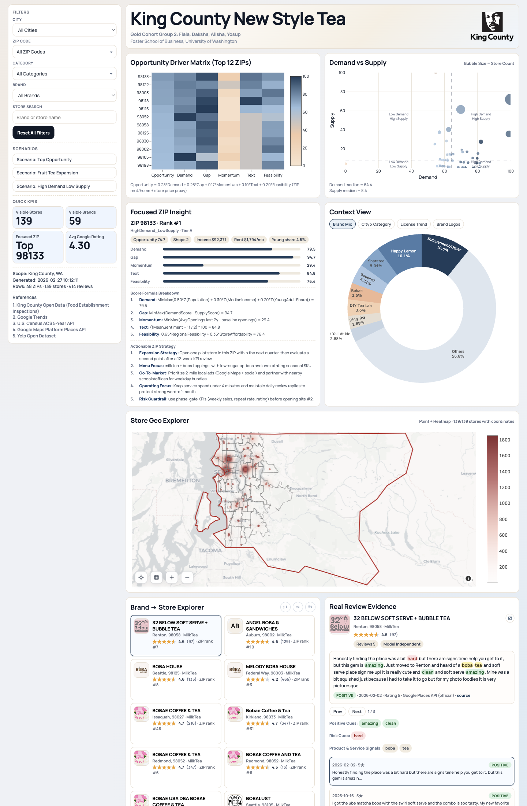

# King County New Style Tea Intelligence

> A founder-oriented market entry project for new-style tea in King County.

An interactive decision dashboard for choosing where and how to open a new-style tea shop in King County, Washington.



## Start Here

If you only do one thing, open the live dashboard:

- [Live Dashboard](https://is521.flalaz.com)
- [GitHub Pages Backup Link](https://flalagogogo.github.io/king-county-new-style-tea-analysis/)
- [Reference Tables](data/reference/)

## Quick Links

- [Open the Dashboard](https://is521.flalaz.com)
- [Open the Backup Link](https://flalagogogo.github.io/king-county-new-style-tea-analysis/)
- [Browse Reference Data](data/reference/)
- [Browse Processed Data](data/processed/)
- [Browse Configs](configs/)
- [Browse Public Scripts](scripts/)
- [Browse Brand Logos](assets/logos/)
- [Open the Published HTML](docs/index.html)

## Project Snapshot

- 48 ZIP codes in scope
- 139 tea-forward stores
- 59 brands
- 414 review rows in the current curated evidence pool
- 5 scoring dimensions: Demand, Gap, Momentum, Text, and Feasibility

## What This Project Is

This project asks a practical founder question:

**If we wanted to open a new-style tea shop in King County, where should we open first, what should we sell, and what operational risks should we prepare for?**

To answer that question, we combine:

- ZIP-level opportunity ranking
- demand vs. supply structure
- store landscape and brand mapping
- review-based explainability
- action-oriented expansion suggestions

## Why This Matters

King County has strong demand for bubble tea and other new-style tea drinks, but supply is uneven across neighborhoods.

Some ZIP codes already have dense store clusters. Others show strong demand with fewer stores and more room for a first-time operator. For a founder, choosing the wrong ZIP can mean high rent, heavy competition, and weak execution from day one.

This dashboard turns public data, platform data, and curated local evidence into a practical decision workflow.

## How To Use The Dashboard

If this is your first time using the dashboard, follow this order:

1. Start with **Opportunity Driver Matrix** to see which ZIP codes rank highest.
2. Check **Demand vs Supply** to understand whether a ZIP is high-demand / low-supply or already crowded.
3. Read **Focused ZIP Insight** for score explanation and suggested strategy.
4. Use **Store Geo Explorer** and **Brand -> Store Explorer** to inspect the actual store landscape.
5. Open **Real Review Evidence** to understand product signals, positive cues, and operational risks.

## Recommended Demo Flow

For a quick 2-minute walkthrough:

1. Reset all filters.
2. Click a top ZIP in the **Opportunity Driver Matrix**.
3. Read the **Focused ZIP Insight**.
4. Inspect store density in **Store Geo Explorer**.
5. Review one real comment in **Real Review Evidence**.
6. Switch scenarios and compare how the recommendation changes.

## What You Will See In The Dashboard

### Opportunity Driver Matrix

Ranks top ZIP codes using five dimensions:

- Demand
- Gap
- Momentum
- Text
- Feasibility

### Demand vs Supply

Shows where each ZIP sits in the market:

- high demand / low supply
- high demand / high supply
- low demand / low supply
- low demand / high supply

### Focused ZIP Insight

Explains one selected ZIP in plain language:

- score breakdown
- formula logic
- founder-oriented strategy suggestions

### Store Geo Explorer

Shows store locations across King County and highlights selected ZIP areas.

### Brand -> Store Explorer

Lets users inspect stores by city, category, brand, ZIP, rating, and logo availability.

### Real Review Evidence

Adds explainability through real review text:

- Positive Cues
- Risk Cues
- Product & Service Signals

## Key Decision Logic

We score each ZIP using five components:

- **Demand**: population, income, and young-adult share
- **Gap**: demand minus local supply pressure
- **Momentum**: recent opening activity
- **Text**: review sentiment and review-derived product/service signals
- **Feasibility**: regional affordability and cost pressure

This is not a sales forecast.

It is a decision-prioritization system for identifying which ZIPs deserve deeper founder attention.

## Scenario Views

The dashboard supports three scenario-based views:

- **Top Opportunity**: overall best first-store candidates
- **Fruit Tea Expansion**: ZIPs where a lighter fruit-tea-led concept may fit better
- **High Demand Low Supply**: areas with strong unmet demand and lower saturation

## Data Sources

This project uses a combination of public, platform, and curated sources:

1. King County Open Data
2. Google Trends
3. U.S. Census ACS 5-Year API
4. Google Maps Platform Places API
5. Yelp Open Dataset
6. Manually curated local review evidence

## Repository Structure

```text
docs/                  published dashboard for GitHub Pages
data/reference/        dashboard-ready reference tables
data/processed/        processed analysis tables
data/raw/              selected source tables safe for public sharing
data/interim/          small helper tables used by selected scripts
data/external/geo/     geographic boundary files used by the dashboard map
configs/               taxonomy and scoring configuration
scripts/               public analysis and dashboard scripts
assets/logos/          tea-brand logo files used in the dashboard
assets/king_county_logo.png
screenshots/           preview images
```

## Course Context

This repository was created for **IS521** as a final group project.

**Gold Cohort Group 2**

- [Flala](https://www.linkedin.com/in/flala/)
- Daksha
- Alisha
- Yosup

Foster School of Business
University of Washington

## Limitations

- This dashboard is a decision-support tool, not a guarantee of business success.
- Some review evidence is stronger in certain ZIP codes than others.
- Platform data and online listings may change over time.
- Store economics are estimated through observable signals, not direct lease contracts or full P&L access.

## Project Goal

The goal is simple:

**Help a first-time founder move from "I like tea" to "I can make a better first-store decision."**
